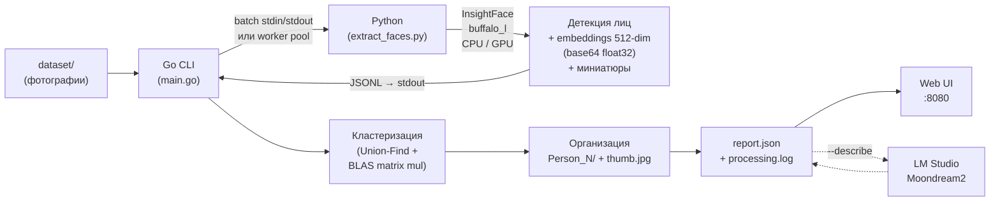

# Face Grouping Service

Сервис для автоматической группировки фотографий по людям. Анализирует изображения при помощи нейросетевой модели [InsightFace](https://github.com/deepinsight/insightface), извлекает face embeddings и кластеризует лица по косинусному сходству. Поддерживает GPU-ускорение с асинхронной предзагрузкой изображений, BLAS-ускоренную кластеризацию, генерацию миниатюр лиц, описания через LM Studio (Moondream2) и веб-интерфейс для просмотра результатов.

## Как это работает



### Пайплайн

1. **Сканирование** — Go обходит входную директорию и собирает все `.jpeg`, `.jpg`, `.png` файлы
2. **Извлечение embeddings** — Python-скрипт с InsightFace (модель `buffalo_l`) детектирует лица и возвращает 512-мерные нормализованные embedding-векторы в формате base64 float32. В GPU-режиме запускается один процесс с потоковым вводом/выводом (batch) и асинхронной предзагрузкой изображений (4 потока, глубина очереди 8), на CPU — параллельный worker pool
3. **Генерация миниатюр** — для каждого обнаруженного лица вырезается crop с паддингом 25%, масштабируется до 160×160 и сохраняется в `.thumbnails/`. Запись миниатюр выполняется асинхронно в отдельном пуле потоков
4. **Кластеризация** — Go вычисляет матрицу косинусного сходства через BLAS-ускоренное блочное матричное перемножение (gonum) и группирует лица через Union-Find (disjoint set с path compression и union by rank)
5. **Организация** — для каждого кластера создается папка `Person_N/` с символическими ссылками на оригиналы и лучшей миниатюрой лица (`thumb.jpg`)
6. **Описание (опционально)** — миниатюра отправляется в LM Studio (Moondream2) для генерации текстового описания внешности
7. **Отчёт** — сохраняется JSON-отчёт (`report.json`) и лог обработки (`processing.log`)
8. **Веб-интерфейс (опционально)** — Go HTTP-сервер с graceful shutdown и тёмной темой для просмотра результатов в браузере

> Если на фото несколько людей — оно появится в нескольких папках `Person_N/`.

## Требования

| Компонент | Версия |
|-----------|--------|
| Go | 1.24+ |
| Python | 3.10+ |
| ОС | Windows / Linux / macOS |
| GPU (опционально) | NVIDIA с поддержкой CUDA |

На **Windows** для создания символических ссылок необходим Developer Mode или запуск от имени администратора.

## Установка

```bash
# 1. Сборка Go-бинарника
go build -o face-grouper.exe .

# 2. Установка Python-зависимостей
pip install -r scripts/requirements.txt
```

> `requirements.txt` включает `onnxruntime-gpu`. Если GPU нет, замените на `onnxruntime` — скрипт автоматически упадёт на CPU.

При первом запуске InsightFace автоматически скачает модель `buffalo_l` (~300 MB) в `~/.insightface/models/`.

## Запуск

```bash
# Базовый запуск на CPU
./face-grouper.exe

# GPU + веб-интерфейс
./face-grouper.exe --gpu --serve

# GPU + описания через Moondream2 + веб
./face-grouper.exe --gpu --describe --serve

# Все параметры
./face-grouper.exe --input ./photos --output ./results --workers 8 --threshold 0.6 --gpu --serve --port 3000

# Просмотр предыдущих результатов без повторной обработки
./face-grouper.exe --view --output ./output
```

### Параметры CLI

| Флаг | По умолчанию | Описание |
|------|-------------|----------|
| `--input` | `./dataset` | Директория с исходными фотографиями |
| `--output` | `./output` | Директория для результатов группировки |
| `--workers` | `4` | Количество параллельных воркеров (CPU-режим) |
| `--threshold` | `0.5` | Порог косинусного сходства для объединения лиц (0.0–1.0) |
| `--python` | `python` | Путь к Python-интерпретатору |
| `--gpu` | `false` | Использовать CUDA GPU для InsightFace |
| `--serve` | `false` | Запустить веб-интерфейс после обработки |
| `--port` | `8080` | Порт веб-сервера |
| `--describe` | `false` | Генерировать описания через LM Studio (Moondream2) |
| `--config` | `config.json` | Путь к файлу конфигурации |
| `--view` | `false` | Только просмотр результатов (без обработки) |

### Пример вывода

```
=== Scanning directory ===
Found 685 image(s)

=== Extracting face embeddings ===
Mode: GPU (CUDA), batch streaming
[1/685] C:\photos\TCF_001.jpeg — found 2 face(s)
[2/685] C:\photos\TCF_002.jpeg — found 1 face(s)
...

Total faces detected: 1247 (errors: 3)

=== Clustering faces ===
Found 42 person(s)

=== Organizing output ===
Person_1: 87 unique photo(s)
Person_2: 64 unique photo(s)
...

=== Summary ===
Images:  685
Faces:   1247
Persons: 42
Errors:  3
Time:    4m12s
Report:  ./output/report.json
Log:     ./output/processing.log

Tip: run with --serve to view results in browser, or --view to view previous results
```

## Конфигурация

Файл `config.json` содержит настройки для интеграции с LM Studio:

```json
{
  "lm_studio": {
    "endpoint": "http://localhost:1234/v1",
    "model": "moondream2",
    "max_tokens": 200
  }
}
```

| Поле | Описание |
|------|----------|
| `endpoint` | URL OpenAI-совместимого API (LM Studio по умолчанию на порту 1234) |
| `model` | Название модели в LM Studio (загрузите `moondream2` через интерфейс LM Studio) |
| `max_tokens` | Максимальное количество токенов в описании |

Для использования: запустите LM Studio, загрузите модель Moondream2 и добавьте флаг `--describe` при запуске.

## Веб-интерфейс

Встроенный HTTP-сервер с graceful shutdown и тёмной темой для просмотра результатов:

- Сетка карточек персон с миниатюрами лиц и количеством фото
- Описание внешности (при использовании `--describe`)
- Просмотр всех фотографий персоны по клику с превью лица в заголовке
- Кликабельный счётчик ошибок с детализацией (имя файла + текст ошибки)
- Полноэкранный просмотр фото
- Адаптивная вёрстка
- Корректное завершение по Ctrl+C (graceful shutdown с таймаутом 5 сек)

Запуск: `--serve` (после обработки) или `--view` (просмотр готовых результатов).

## Структура проекта

```
├── main.go                            # Точка входа, CLI-флаги, оркестрация пайплайна
├── go.mod
├── config.json                        # Конфигурация LM Studio / Moondream2
├── internal/
│   ├── models/
│   │   └── models.go                  # Типы данных: Face, ExtractionResult, Cluster
│   ├── scanner/
│   │   └── scanner.go                 # Рекурсивное сканирование директории
│   ├── extractor/
│   │   └── extractor.go               # Batch (GPU) / Worker pool (CPU), парсинг JSON
│   ├── clustering/
│   │   └── clustering.go              # Union-Find + cosine similarity кластеризация
│   ├── organizer/
│   │   └── organizer.go               # Person_N/ директории, symlinks, миниатюры
│   ├── report/
│   │   └── report.go                  # Генерация и загрузка JSON-отчёта
│   ├── describer/
│   │   └── describer.go               # Клиент LM Studio Vision API (Moondream2)
│   └── web/
│       ├── web.go                     # HTTP-сервер
│       └── index.html                 # Встроенный веб-интерфейс (go:embed)
├── scripts/
│   ├── extract_faces.py               # Python: InsightFace детекция + embeddings + миниатюры
│   └── requirements.txt               # Python-зависимости
├── dataset/                           # Исходные фотографии для обработки
└── output/                            # Результаты
    ├── processing.log                 # Лог обработки
    ├── report.json                    # JSON-отчёт
    ├── .thumbnails/                   # Все face crops
    ├── Person_1/
    │   ├── thumb.jpg                  # Лучшая миниатюра лица
    │   ├── photo1.jpg → оригинал     # Символические ссылки
    │   └── photo2.jpg → оригинал
    └── Person_N/
        └── ...
```

## Модули

### `internal/models` — типы данных

- **`Face`** — обнаруженное лицо: bounding box `[x1, y1, x2, y2]`, 512-мерный embedding (поддержка base64 float32 и JSON-массива), уверенность детекции, путь к миниатюре, путь к исходному файлу. Кастомный `UnmarshalJSON` для обратной совместимости обоих форматов
- **`ExtractionResult`** — JSON-ответ от Python-скрипта: список лиц + опциональная ошибка + путь к файлу (batch-режим)
- **`Cluster`** — группа лиц одного человека

### `internal/scanner` — сканирование

Рекурсивно обходит директорию через `filepath.Walk`, фильтрует по расширениям (`.jpeg`, `.jpg`, `.png`), возвращает абсолютные пути.

### `internal/extractor` — извлечение embeddings

Два режима работы:
- **GPU (batch)** — один Python-процесс, пути передаются через stdin, результаты читаются из stdout (JSONL). Модель загружается однократно. Non-JSON вывод (инициализация ONNX Runtime) игнорируется с предупреждением
- **CPU (parallel)** — worker pool с настраиваемым числом горутин, каждый вызывает Python-скрипт отдельно

### `internal/clustering` — кластеризация

Строит матрицу L2-нормализованных embeddings и вычисляет косинусное сходство через блочное матричное перемножение (gonum BLAS `dgemm`). Блоки размером 512×512 обеспечивают эффективное использование CPU-кэша. Пары с сходством >= порога объединяются через Union-Find (disjoint set с path compression и union by rank).

### `internal/organizer` — организация результатов

Создает директории `output/Person_N/`, сортирует кластеры по размеру (Person_1 — самая большая группа). Создает символические ссылки на оригиналы. Выбирает лучшую миниатюру лица (максимальный `det_score`) и копирует как `thumb.jpg`. Дедуплицирует по пути файла.

### `internal/report` — отчёт

Структурированный JSON-отчёт с метриками обработки: количество изображений, лиц, персон, ошибок, время, пороги. Включает детализацию ошибок по файлам (`file_errors`). Для каждой персоны — количество фото, миниатюра, описание, список путей к фото.

### `internal/describer` — описание внешности

Клиент OpenAI-совместимого Vision API. Отправляет миниатюру лица в LM Studio (Moondream2) и получает текстовое описание внешности: пол, возраст, цвет волос, отличительные черты.

### `internal/web` — веб-интерфейс

Встроенный HTTP-сервер (Go `net/http` + `embed`) с graceful shutdown по SIGINT/SIGTERM. Отдает HTML-страницу с JavaScript, который загружает `report.json` через API и рендерит интерфейс: карточки персон с превью лица в detail view, кликабельный счётчик ошибок с модальным окном детализации, сетку фотографий, полноэкранный просмотр.

### `scripts/extract_faces.py` — Python-скрипт

Использует `insightface.app.FaceAnalysis` с моделью `buffalo_l` (SCRFD детектор + ArcFace эмбеддер). Поддерживает два режима:

- **Single** — `python extract_faces.py image.jpg [--gpu] [--thumb-dir DIR]`
- **Batch** — `python extract_faces.py --batch [--gpu] [--thumb-dir DIR]` — читает пути из stdin, отдает JSONL

Оптимизации производительности:
- **Асинхронная предзагрузка** — `ThreadPoolExecutor` (4 потока) читает следующие изображения с диска, пока GPU обрабатывает текущее (глубина очереди 8)
- **Параллельное сохранение миниатюр** — отдельный пул потоков для I/O-операций записи crop-файлов
- **Base64 embedding** — вместо JSON-массива из 512 чисел (~8 КБ) передаётся base64-encoded float32 (~2.7 КБ), трафик через pipe сокращён в 3 раза
- **Перенаправление stdout** — диагностический вывод ONNX Runtime при инициализации перенаправляется в stderr, чтобы не засорять JSONL-поток

Формат вывода:

```json
{
  "file": "path/to/image.jpg",
  "faces": [
    {
      "bbox": [102.5, 45.2, 287.1, 310.8],
      "embedding": "base64-encoded float32 (512 dims)",
      "det_score": 0.95,
      "thumbnail": ".thumbnails/image_face_0.jpg"
    }
  ]
}
```

## Настройка порога

Параметр `--threshold` контролирует строгость группировки:

| Значение | Эффект |
|----------|--------|
| `0.3` | Агрессивная группировка, больше ложных совпадений |
| `0.5` | Сбалансированный (по умолчанию) |
| `0.7` | Строгая группировка, может разбить одного человека на несколько кластеров |

Рекомендуется начать с `0.5` и корректировать по результатам.

## Зависимости

### Go

| Пакет | Назначение |
|-------|-----------|
| `gonum.org/v1/gonum` | BLAS-ускоренное матричное перемножение для кластеризации embeddings |

### Python

| Пакет | Назначение |
|-------|-----------|
| `insightface` | Детекция лиц и извлечение face embeddings (модель buffalo_l) |
| `onnxruntime-gpu` | Инференс ONNX-моделей на GPU (CUDA). Для CPU-only: `onnxruntime` |
| `numpy` | Работа с массивами embeddings |
| `opencv-python-headless` | Чтение изображений, генерация миниатюр |

## Лицензия

MIT
