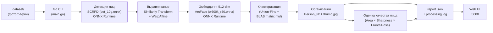

# Face Grouping Service

Сервис для автоматической группировки фотографий по людям. Анализирует изображения при помощи нейросетевых моделей [InsightFace](https://github.com/deepinsight/insightface) (SCRFD + ArcFace) через ONNX Runtime, извлекает face embeddings и кластеризует лица по косинусному сходству. Полностью нативная Go-реализация без зависимости от Python и OpenCV. Поддерживает GPU-ускорение (CUDA), BLAS-ускоренную кластеризацию, генерацию миниатюр лиц, алгоритмический выбор аватара и веб-интерфейс для просмотра результатов.

## Как это работает



### Пайплайн

1. **Сканирование** — Go обходит входную директорию и собирает все `.jpeg`, `.jpg`, `.png` файлы
2. **Детекция лиц** — SCRFD модель (`det_10g.onnx`) через ONNX Runtime Go биндинги: letterbox preprocessing (640x640), 3-уровневый FPN (strides 8/16/32), декодирование bbox + keypoints, NMS (IoU 0.4)
3. **Выравнивание лиц** — similarity transform (Umeyama algorithm) по 5 ключевым точкам, WarpAffine до 112x112 на чистом Go (билинейная интерполяция)
4. **Извлечение embeddings** — ArcFace модель (`w600k_r50.onnx`): нормализация (mean=127.5, std=127.5), batch inference, L2-нормализация 512-мерных векторов
5. **Генерация миниатюр** — для каждого обнаруженного лица вырезается crop с паддингом 25%, масштабируется до 160x160 и сохраняется как JPEG (quality 90)
6. **Кластеризация** — Go вычисляет матрицу косинусного сходства через BLAS-ускоренное блочное матричное перемножение (gonum) и группирует лица через Union-Find (disjoint set с path compression и union by rank)
7. **Организация** — для каждого кластера создается папка `Person_N/` с символическими ссылками на оригиналы и лучшей миниатюрой лица (`thumb.jpg`); при совпадающих именах файлов применяется уникализация
8. **Выбор аватара** — для каждой персоны выбирается лучший crop по формуле `Score = Area × Sharpness × FrontalPoseFactor`; обновление выполняется только при приросте качества выше порога
9. **Отчёт** — сохраняется JSON-отчёт (`report.json`) и лог обработки (`processing.log`) c `avatar_path` и `quality_score`
10. **Веб-интерфейс (опционально)** — Go HTTP-сервер с graceful shutdown и тёмной темой для просмотра результатов в браузере

> Если на фото несколько людей — оно появится в нескольких папках `Person_N/`.

## Требования

| Компонент | Версия |
|-----------|--------|
| Go | 1.24+ |
| ONNX Runtime | 1.24+ |
| ОС | Windows / Linux / macOS |
| GPU (опционально) | NVIDIA с поддержкой CUDA |

> **Примечание:** С версии 0.2 проект использует чистый Go для обработки изображений и больше не требует OpenCV/gocv.

На **Windows** для создания символических ссылок необходим Developer Mode или запуск от имени администратора.

## Установка

### 1. ONNX Runtime

Скачайте shared library с [github.com/microsoft/onnxruntime/releases](https://github.com/microsoft/onnxruntime/releases):

- **Windows**: `onnxruntime.dll` (из пакета `onnxruntime-win-x64-*.zip`)
- **Linux**: `libonnxruntime.so` (из `onnxruntime-linux-x64-*.tgz`)
- **macOS**: `libonnxruntime.dylib` (из `onnxruntime-osx-*.tgz`)

Для GPU-ускорения скачайте GPU-версию (`onnxruntime-win-x64-gpu-*.zip`).

Поместите библиотеку в PATH или укажите путь через `--ort-lib`.

### 2. ONNX-модели InsightFace

Скачайте модели из [InsightFace model zoo](https://github.com/deepinsight/insightface/tree/master/model_zoo#buffalo_l) (пакет `buffalo_l`):

- `det_10g.onnx` (~17 MB) — SCRFD детектор лиц
- `w600k_r50.onnx` (~174 MB) — ArcFace распознавание лиц

**Способ 1: Вручную через браузер**
1. Откройте https://github.com/deepinsight/insightface/tree/master/model_zoo#buffalo_l
2. Скачайте `det_10g.onnx` и `w600k_r50.onnx`
3. Поместите в `./models/`

**Способ 2: Через Python (рекомендуется)**
```powershell
py -m pip install huggingface_hub
py -c "from huggingface_hub import hf_hub_download; hf_hub_download('deepinsight/insightface', 'buffalo_l/det_10g.onnx', local_dir='./models')"
py -c "from huggingface_hub import hf_hub_download; hf_hub_download('deepinsight/insightface', 'buffalo_l/w600k_r50.onnx', local_dir='./models')"
```

**Способ 3: Скриптом проекта**
```powershell
powershell -ExecutionPolicy Bypass -File .\scripts\download-models.ps1
```

Поместите оба файла в каталог `./models/` (или укажите путь через `--models-dir`).

### 3. Сборка проекта

**Windows (простая сборка без MSYS2):**
```powershell
go build -o face-grouper.exe .
```

**Linux / macOS:**
```bash
go build -o face-grouper .
```

> **Примечание:** Для сборки больше не требуется MSYS2/OpenCV. Только Go компилятор.

**Скрипт сборки (опционально):**
```powershell
powershell -ExecutionPolicy Bypass -File .\scripts\build.ps1
```

Скрипт поддерживает параметры:
- `-Output "face-grouper.exe"` — имя выходного файла
- `-SkipClean` — не выполнять `go clean -cache`

### 4. GPU-запуск на Windows

Для GPU-запуска требуется:
1. NVIDIA GPU с поддержкой CUDA
2. Установленные драйверы CUDA
3. ONNX Runtime GPU версия

**Простой запуск:**
```powershell
# Скачать ONNX Runtime GPU и запустить
.\face-grouper.exe --gpu --serve
```

**Скрипт run-gpu.ps1 (опционально):**

Скрипт `scripts/run-gpu.ps1` автоматически:
- скачивает актуальный ONNX Runtime GPU в `./runtime/`
- запускает `face-grouper.exe` с `--gpu` и корректным `--ort-lib`

Полезные параметры скрипта: `-InputDir`, `-OutputDir`, `-ModelsDir`, `-OrtVersion`, `-Serve`, `-GpuDetSessions`, `-GpuRecSessions`, `-EmbedBatchSize`, `-EmbedFlushMs`, `-AvatarUpdateThreshold`, `-IntraThreads`, `-InterThreads`.

```powershell
# Базовый GPU запуск
powershell -ExecutionPolicy Bypass -File .\scripts\run-gpu.ps1

# GPU + веб-интерфейс
powershell -ExecutionPolicy Bypass -File .\scripts\run-gpu.ps1 -Serve

# Агрессивный тюнинг батчей/сессий
powershell -ExecutionPolicy Bypass -File .\scripts\run-gpu.ps1 -GpuDetSessions 3 -GpuRecSessions 3 -EmbedBatchSize 96 -EmbedFlushMs 8 -IntraThreads 0 -InterThreads 0

# Кастомные вход/выход
powershell -ExecutionPolicy Bypass -File .\scripts\run-gpu.ps1 -InputDir .\photos -OutputDir .\results
```

## Запуск

### Windows GPU (рекомендуется)

```powershell
.\face-grouper.exe --gpu --serve
```

### Прямой запуск CLI

```bash
# Базовый запуск на CPU
./face-grouper --input ./photos

# GPU + веб-интерфейс
./face-grouper --gpu --serve

# Все параметры
./face-grouper --input ./photos --output ./results --workers 8 --threshold 0.6 --gpu --max-dim 2560 --serve --port 3000 --avatar-update-threshold 0.10

# Просмотр предыдущих результатов без повторной обработки
./face-grouper --view --output ./output
```

## Тестирование и CI

### Локальные тесты core-пакетов

```bash
go test ./internal/scanner ./internal/report ./internal/clustering -count=1
```

### Compile-check пакетов без CGO

```bash
go test ./internal/avatar ./internal/organizer ./internal/web -count=1
```

### Benchmark кластеризации

```bash
go test ./internal/clustering -bench BenchmarkCluster512D -benchmem -run ^$
```

### CI (GitHub Actions)

В репозитории настроен workflow `.github/workflows/ci.yml`, который запускается на `push` и `pull_request` и выполняет:
- unit-тесты `scanner/report/clustering`
- compile-check `avatar/organizer/web`

### Параметры CLI

| Флаг | По умолчанию | Описание |
|------|-------------|----------|
| `--input` | `./dataset` | Директория с исходными фотографиями |
| `--output` | `./output` | Директория для результатов группировки |
| `--models-dir` | `./models` | Директория с ONNX-моделями (det_10g.onnx, w600k_r50.onnx) |
| `--ort-lib` | *авто* | Путь к ONNX Runtime shared library |
| `--workers` | `4` | Количество параллельных воркеров |
| `--gpu-det-sessions` | `2` | Количество detector-сессий в GPU режиме |
| `--gpu-rec-sessions` | `2` | Количество recognizer-сессий в GPU режиме |
| `--embed-batch-size` | `64` | Размер межфайлового батча распознавания лиц |
| `--embed-flush-ms` | `10` | Таймаут flush батча распознавания (мс) |
| `--threshold` | `0.5` | Порог косинусного сходства для объединения лиц (0.0–1.0) |
| `--det-thresh` | `0.5` | Порог уверенности детекции лиц |
| `--gpu` | `false` | Использовать CUDA GPU для ONNX Runtime |
| `--intra-threads` | `0` | Intra-op потоки ONNX Runtime (0 = default) |
| `--inter-threads` | `0` | Inter-op потоки ONNX Runtime (0 = default) |
| `--max-dim` | `1920` | Уменьшать изображения до N px по длинной стороне (0 = без ресайза) |
| `--avatar-update-threshold` | `0.10` | Минимальный относительный прирост quality score для обновления аватара |
| `--serve` | `false` | Запустить веб-интерфейс после обработки |
| `--port` | `8080` | Порт веб-сервера |
| `--view` | `false` | Только просмотр результатов (без обработки) |

### Пример вывода

```
=== Scanning directory ===
Found 685 image(s)

=== Extracting face embeddings ===
Mode: CPU, 4 worker(s)
Pre-resize: max 1920px
[1/685] C:\photos\TCF_001.jpeg — found 2 face(s)
[2/685] C:\photos\TCF_002.jpeg — found 1 face(s)
...

Total faces detected: 1247 (errors: 3)

=== Clustering faces ===
Found 42 person(s)

=== Organizing output ===
Person_1: 87 unique photo(s)
Person_2: 64 unique photo(s)
...

=== Summary ===
Images:  685
Faces:   1247
Persons: 42
Errors:  3
Time:    4m12s
Report:  ./output/report.json
Log:     ./output/processing.log

Tip: run with --serve to view results in browser, or --view to view previous results
```

## Алгоритмический выбор аватара

Для каждой персоны вычисляется quality score по формуле:

`Score = (Width * Height) * Sharpness * FrontalPoseFactor`

- `Width * Height` — площадь лица по bbox.
- `Sharpness` — дисперсия лапласиана по crop лица.
- `FrontalPoseFactor` — фактор фронтальности (по landmark-геометрии, ближе к 1 при меньшем повороте).

Если при повторной обработке новый score не превосходит предыдущий минимум на `--avatar-update-threshold` (по умолчанию 10%), аватар не обновляется.

## Веб-интерфейс

Встроенный HTTP-сервер с graceful shutdown и тёмной темой для просмотра результатов:

- Сетка карточек персон с миниатюрами лиц и количеством фото
- Отображение выбранного алгоритмом аватара
- Показ `quality_score` для контроля качества выбора
- Просмотр всех фотографий персоны по клику с превью лица в заголовке
- Кликабельный счётчик ошибок с детализацией (имя файла + текст ошибки)
- Полноэкранный просмотр фото
- Адаптивная вёрстка
- Корректное завершение по Ctrl+C (graceful shutdown с таймаутом 5 сек)

Запуск: `--serve` (после обработки) или `--view` (просмотр готовых результатов).

## Структура проекта

```
├── .github/
│   └── workflows/
│       └── ci.yml                    # CI: unit tests + compile-check
├── main.go                            # Точка входа, CLI-флаги, оркестрация пайплайна
├── go.mod
├── scripts/
│   ├── build.ps1                      # Сборка под Windows/MSYS2 (CGO/OpenCV)
│   └── run-gpu.ps1                    # Автоподготовка зависимостей и запуск GPU
├── models/                            # ONNX-модели InsightFace
│   ├── det_10g.onnx                   # SCRFD детектор лиц
│   └── w600k_r50.onnx                 # ArcFace распознавание лиц
├── internal/
│   ├── models/
│   │   └── models.go                  # Типы данных: Face, Cluster
│   ├── scanner/
│   │   ├── scanner.go                 # Рекурсивное сканирование директории
│   │   └── scanner_test.go            # Unit tests
│   ├── inference/
│   │   ├── ort.go                     # Инициализация ONNX Runtime
│   │   ├── detector.go                # SCRFD детекция лиц
│   │   ├── recognizer.go             # ArcFace эмбеддинги
│   │   ├── align.go                   # Similarity transform + WarpAffine
│   │   └── nms.go                     # Non-Maximum Suppression
│   ├── extractor/
│   │   └── extractor.go               # Worker pool, оркестрация inference pipeline
│   ├── clustering/
│   │   ├── clustering.go              # Union-Find + cosine similarity кластеризация
│   │   └── clustering_test.go         # Unit tests + benchmark
│   ├── organizer/
│   │   └── organizer.go               # Person_N/ директории, symlinks, миниатюры
│   ├── report/
│   │   ├── report.go                  # Генерация и загрузка JSON-отчёта
│   │   └── report_test.go             # Unit tests
│   ├── avatar/
│   │   └── score.go                   # Оценка качества лица и frontal-factor
│   └── web/
│       ├── web.go                     # HTTP-сервер
│       └── index.html                 # Встроенный веб-интерфейс (go:embed)
├── dataset/                           # Исходные фотографии для обработки
└── output/                            # Результаты
    ├── processing.log                 # Лог обработки
    ├── report.json                    # JSON-отчёт
    ├── .thumbnails/                   # Все face crops
    ├── Person_1/
    │   ├── thumb.jpg                  # Лучшая миниатюра лица
    │   ├── photo1.jpg → оригинал     # Символические ссылки
    │   └── photo2.jpg → оригинал
    └── Person_N/
        └── ...
```

## Модули

### `internal/inference` — нативный inference

ONNX Runtime Go-биндинги для прямого запуска моделей InsightFace:

- **`ort.go`** — инициализация/финализация ONNX Runtime, загрузка shared library, создание сессий с CPU/CUDA провайдерами
- **`detector.go`** — SCRFD детектор: letterbox resize, нормализация (mean=127.5, std=128.0), NCHW конвертация, декодирование anchor-based выходов по 3 уровням FPN, фильтрация по порогу
- **`recognizer.go`** — ArcFace: нормализация (mean=127.5, std=127.5), batch inference, L2-нормализация 512-мерных эмбеддингов
- **`align.go`** — Umeyama similarity transform по 5 facial landmarks, WarpAffine на чистом Go (билинейная интерполяция) для выравнивания лица до 112x112
- **`nms.go`** — greedy Non-Maximum Suppression с IoU threshold

### `internal/imageutil` — обработка изображений на чистом Go

- **`image.go`** — загрузка/сохранение JPEG, resize (билинейная интерполяция), blob conversion (NCHW), warp affine transform, crop

### `internal/extractor` — оркестрация extraction pipeline

Worker pool из горутин, каждый worker: загрузка изображения (чистый Go) → опциональный downscale (`--max-dim`) → SCRFD детекция → alignment по keypoints → отправка aligned-лиц в межфайловый batcher распознавания (`--embed-batch-size`, `--embed-flush-ms`) → сохранение thumbnail (crop + resize 160x160, JPEG q90).

CPU-режим использует пул ONNX-сессий размером `workers`. GPU-режим использует отдельные пулы detector/recognizer сессий (`--gpu-det-sessions`, `--gpu-rec-sessions`) без глобальной блокировки inference.

### `internal/models` — типы данных

- **`Face`** — обнаруженное лицо: bounding box `[x1, y1, x2, y2]`, 512-мерный embedding, уверенность детекции, путь к миниатюре, путь к исходному файлу
- **`Cluster`** — группа лиц одного человека

### `internal/clustering` — кластеризация

Строит матрицу L2-нормализованных embeddings и вычисляет косинусное сходство через блочное матричное перемножение (gonum BLAS `dgemm`). Блоки размером 512x512 обеспечивают эффективное использование CPU-кэша. Пары с сходством >= порога объединяются через Union-Find.

### `internal/organizer` — организация результатов

Создает директории `output/Person_N/`, сортирует кластеры по размеру. Создает символические ссылки на оригиналы (fallback на stream-copy). Выбирает лучший аватар по quality score (`Area × Sharpness × FrontalPoseFactor`) и сохраняет в `output/avatars/`. При коллизиях имён файлов применяется уникализация.

### `internal/report` — отчёт

Структурированный JSON-отчёт с метриками обработки.

### `internal/web` — веб-интерфейс

Встроенный HTTP-сервер (Go `net/http` + `embed`) с graceful shutdown.

## Настройка порога

Параметр `--threshold` контролирует строгость группировки:

| Значение | Эффект | Когда использовать |
|----------|--------|-------------------|
| `0.30-0.35` | Очень строгая группировка, минимум ложных совпадений | Когда на фото много разных людей |
| `0.40-0.45` | Строгая группировка, баланс точности | Для смешанных наборов фото |
| `0.50` | Сбалансированный (по умолчанию) | Универсальный вариант |
| `0.60-0.70` | Агрессивная группировка, больше ложных совпадений | Когда на фото один человек |

> **Важно:** Для ArcFace/InsightFace модели типичные значения косинусного сходства:
> - **Один человек:** 0.50-0.90
> - **Разные люди:** 0.00-0.40
>
> Если все фото с одного мероприятия (один человек), используйте порог **0.35-0.40**.

Рекомендуется начать с `0.50` и корректировать по результатам.

## Зависимости

| Пакет | Назначение |
|-------|-----------|
| `github.com/yalue/onnxruntime_go` | Go-биндинги для ONNX Runtime (CPU/CUDA inference) |
| `golang.org/x/image` | Обработка изображений на чистом Go (resize, decode/encode) |
| `gonum.org/v1/gonum` | BLAS-ускоренное матричное перемножение для кластеризации embeddings |

## Лицензия

MIT
