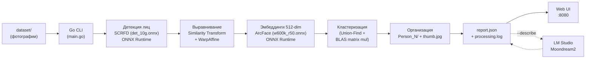

# Face Grouping Service

Сервис для автоматической группировки фотографий по людям. Анализирует изображения при помощи нейросетевых моделей [InsightFace](https://github.com/deepinsight/insightface) (SCRFD + ArcFace) через ONNX Runtime, извлекает face embeddings и кластеризует лица по косинусному сходству. Полностью нативная Go-реализация без зависимости от Python. Поддерживает GPU-ускорение (CUDA), BLAS-ускоренную кластеризацию, генерацию миниатюр лиц, описания через LM Studio (Moondream2) и веб-интерфейс для просмотра результатов.

## Как это работает



### Пайплайн

1. **Сканирование** — Go обходит входную директорию и собирает все `.jpeg`, `.jpg`, `.png` файлы
2. **Детекция лиц** — SCRFD модель (`det_10g.onnx`) через ONNX Runtime Go биндинги: letterbox preprocessing (640x640), 3-уровневый FPN (strides 8/16/32), декодирование bbox + keypoints, NMS (IoU 0.4)
3. **Выравнивание лиц** — similarity transform (Umeyama algorithm) по 5 ключевым точкам, WarpAffine до 112x112 через gocv/OpenCV
4. **Извлечение embeddings** — ArcFace модель (`w600k_r50.onnx`): нормализация (mean=127.5, std=127.5), batch inference, L2-нормализация 512-мерных векторов
5. **Генерация миниатюр** — для каждого обнаруженного лица вырезается crop с паддингом 25%, масштабируется до 160x160 и сохраняется как JPEG (quality 90)
6. **Кластеризация** — Go вычисляет матрицу косинусного сходства через BLAS-ускоренное блочное матричное перемножение (gonum) и группирует лица через Union-Find (disjoint set с path compression и union by rank)
7. **Организация** — для каждого кластера создается папка `Person_N/` с символическими ссылками на оригиналы и лучшей миниатюрой лица (`thumb.jpg`); при совпадающих именах файлов применяется уникализация
8. **Описание (опционально)** — миниатюра отправляется в LM Studio (Moondream2) для генерации текстового описания внешности, с retry для временных HTTP-ошибок (`429/5xx`)
9. **Отчёт** — сохраняется JSON-отчёт (`report.json`) и лог обработки (`processing.log`)
10. **Веб-интерфейс (опционально)** — Go HTTP-сервер с graceful shutdown и тёмной темой для просмотра результатов в браузере

> Если на фото несколько людей — оно появится в нескольких папках `Person_N/`.

## Требования

| Компонент | Версия |
|-----------|--------|
| Go | 1.24+ |
| OpenCV | 4.12+ |
| ONNX Runtime | 1.24+ |
| ОС | Windows / Linux / macOS |
| GPU (опционально) | NVIDIA с поддержкой CUDA |

На **Windows** для создания символических ссылок необходим Developer Mode или запуск от имени администратора.

## Установка

### 1. ONNX Runtime

Скачайте shared library с [github.com/microsoft/onnxruntime/releases](https://github.com/microsoft/onnxruntime/releases):

- **Windows**: `onnxruntime.dll` (из пакета `onnxruntime-win-x64-*.zip`)
- **Linux**: `libonnxruntime.so` (из `onnxruntime-linux-x64-*.tgz`)
- **macOS**: `libonnxruntime.dylib` (из `onnxruntime-osx-*.tgz`)

Для GPU-ускорения скачайте GPU-версию (`onnxruntime-win-x64-gpu-*.zip`).

Поместите библиотеку в PATH или укажите путь через `--ort-lib`.

### 2. OpenCV (для gocv)

**Windows (MSYS2)**:
```powershell
winget install MSYS2.MSYS2
C:\msys64\usr\bin\bash -lc "pacman -Syu --noconfirm"
C:\msys64\usr\bin\bash -lc "pacman -S --noconfirm mingw-w64-ucrt-x86_64-gcc mingw-w64-ucrt-x86_64-opencv mingw-w64-ucrt-x86_64-pkgconf mingw-w64-ucrt-x86_64-qt6-base"
```

> Важно: не используйте OpenCV из Chocolatey для сборки с `gocv` — обычно это MSVC-сборка и она конфликтует с MinGW/CGO toolchain.

**Linux (Ubuntu/Debian)**:
```bash
sudo apt install libopencv-dev
```

**macOS (Homebrew)**:
```bash
brew install opencv
```

### 3. ONNX-модели InsightFace

Скачайте модели из [InsightFace model zoo](https://github.com/deepinsight/insightface/tree/master/model_zoo) (пакет `buffalo_l`):

- `det_10g.onnx` (~17 MB) — SCRFD детектор лиц
- `w600k_r50.onnx` (~174 MB) — ArcFace распознавание лиц

Поместите оба файла в каталог `./models/` (или укажите путь через `--models-dir`).

### 4. Сборка

**Windows (рекомендуется):**
```powershell
powershell -ExecutionPolicy Bypass -File .\scripts\build.ps1
```

Дополнительно:
- `-Msys2Bin "C:\msys64\ucrt64\bin"` — путь к MSYS2 toolchain (если не указан, авто-поиск: `ucrt64` -> `mingw64` -> `clang64`)
- `-Output "face-grouper.exe"` — имя выходного файла
- `-SkipClean` — не выполнять `go clean -cache`

**Ручная сборка:**
```bash
# Linux / macOS
CGO_ENABLED=1 go build -o face-grouper .

# Windows (MSYS2)
CGO_ENABLED=1 CC=gcc CXX=g++ \
  CGO_CFLAGS="$(pkg-config --cflags opencv4)" \
  CGO_CXXFLAGS="$(pkg-config --cflags opencv4)" \
  CGO_LDFLAGS="$(pkg-config --libs opencv4)" \
  go build -tags customenv -o face-grouper.exe .
```

### 5. GPU-запуск на Windows (авто-подготовка)

Скрипт `scripts/run-gpu.ps1` автоматически:
- выбирает рабочий MSYS2 runtime для OpenCV;
- ставит Qt runtime пакет (`qt6-base`), если его не хватает;
- скачивает актуальный ONNX Runtime GPU в `./runtime/`;
- при необходимости доустанавливает актуальные CUDA/cuDNN DLL через `pip`;
- запускает `face-grouper.exe` с `--gpu`, `--ort-lib` и корректным `--models-dir`.

Полезные параметры скрипта: `-InputDir`, `-OutputDir`, `-ModelsDir`, `-OrtVersion`, `-Msys2Bin`, `-SkipNvidiaRuntimeInstall`, `-Serve`, `-Describe`.

```powershell
# Базовый GPU запуск
powershell -ExecutionPolicy Bypass -File .\scripts\run-gpu.ps1

# GPU + веб-интерфейс
powershell -ExecutionPolicy Bypass -File .\scripts\run-gpu.ps1 -Serve

# GPU + описания + веб
powershell -ExecutionPolicy Bypass -File .\scripts\run-gpu.ps1 -Describe -Serve

# Кастомные вход/выход
powershell -ExecutionPolicy Bypass -File .\scripts\run-gpu.ps1 -InputDir .\photos -OutputDir .\results
```

## Запуск

### Windows GPU (рекомендуется)

```powershell
powershell -ExecutionPolicy Bypass -File .\scripts\run-gpu.ps1 -Serve
```

### Прямой запуск CLI

```bash
# Базовый запуск на CPU
./face-grouper --input ./photos

# GPU + веб-интерфейс
./face-grouper --gpu --serve

# GPU + описания через Moondream2 + веб
./face-grouper --gpu --describe --serve

# Все параметры
./face-grouper --input ./photos --output ./results --workers 8 --threshold 0.6 --gpu --max-dim 2560 --serve --port 3000

# Просмотр предыдущих результатов без повторной обработки
./face-grouper --view --output ./output
```

## Тестирование и CI

### Локальные тесты core-пакетов

```bash
go test ./internal/scanner ./internal/report ./internal/clustering -count=1
```

### Compile-check пакетов без CGO

```bash
go test ./internal/organizer ./internal/describer ./internal/web -count=1
```

### Benchmark кластеризации

```bash
go test ./internal/clustering -bench BenchmarkCluster512D -benchmem -run ^$
```

### CI (GitHub Actions)

В репозитории настроен workflow `.github/workflows/ci.yml`, который запускается на `push` и `pull_request` и выполняет:
- unit-тесты `scanner/report/clustering`
- compile-check `organizer/describer/web`

### Параметры CLI

| Флаг | По умолчанию | Описание |
|------|-------------|----------|
| `--input` | `./dataset` | Директория с исходными фотографиями |
| `--output` | `./output` | Директория для результатов группировки |
| `--models-dir` | `./models` | Директория с ONNX-моделями (det_10g.onnx, w600k_r50.onnx) |
| `--ort-lib` | *авто* | Путь к ONNX Runtime shared library |
| `--workers` | `4` | Количество параллельных воркеров |
| `--threshold` | `0.5` | Порог косинусного сходства для объединения лиц (0.0–1.0) |
| `--det-thresh` | `0.5` | Порог уверенности детекции лиц |
| `--gpu` | `false` | Использовать CUDA GPU для ONNX Runtime |
| `--max-dim` | `1920` | Уменьшать изображения до N px по длинной стороне (0 = без ресайза) |
| `--serve` | `false` | Запустить веб-интерфейс после обработки |
| `--port` | `8080` | Порт веб-сервера |
| `--describe` | `false` | Генерировать описания через LM Studio (Moondream2) |
| `--config` | `config.json` | Путь к файлу конфигурации |
| `--view` | `false` | Только просмотр результатов (без обработки) |

### Пример вывода

```
=== Scanning directory ===
Found 685 image(s)

=== Extracting face embeddings ===
Mode: CPU, 4 worker(s)
Pre-resize: max 1920px
[1/685] C:\photos\TCF_001.jpeg — found 2 face(s)
[2/685] C:\photos\TCF_002.jpeg — found 1 face(s)
...

Total faces detected: 1247 (errors: 3)

=== Clustering faces ===
Found 42 person(s)

=== Organizing output ===
Person_1: 87 unique photo(s)
Person_2: 64 unique photo(s)
...

=== Summary ===
Images:  685
Faces:   1247
Persons: 42
Errors:  3
Time:    4m12s
Report:  ./output/report.json
Log:     ./output/processing.log

Tip: run with --serve to view results in browser, or --view to view previous results
```

## Конфигурация

Файл `config.json` содержит настройки для интеграции с LM Studio:

```json
{
  "lm_studio": {
    "endpoint": "http://localhost:1234/v1",
    "model": "moondream2",
    "max_tokens": 200
  }
}
```

| Поле | Описание |
|------|----------|
| `endpoint` | URL OpenAI-совместимого API (LM Studio по умолчанию на порту 1234) |
| `model` | Название модели в LM Studio (загрузите `moondream2` через интерфейс LM Studio) |
| `max_tokens` | Максимальное количество токенов в описании |

Для использования: запустите LM Studio, загрузите модель Moondream2 и добавьте флаг `--describe` при запуске.

## Веб-интерфейс

Встроенный HTTP-сервер с graceful shutdown и тёмной темой для просмотра результатов:

- Сетка карточек персон с миниатюрами лиц и количеством фото
- Описание внешности (при использовании `--describe`)
- Просмотр всех фотографий персоны по клику с превью лица в заголовке
- Кликабельный счётчик ошибок с детализацией (имя файла + текст ошибки)
- Полноэкранный просмотр фото
- Адаптивная вёрстка
- Корректное завершение по Ctrl+C (graceful shutdown с таймаутом 5 сек)

Запуск: `--serve` (после обработки) или `--view` (просмотр готовых результатов).

## Структура проекта

```
├── .github/
│   └── workflows/
│       └── ci.yml                    # CI: unit tests + compile-check
├── main.go                            # Точка входа, CLI-флаги, оркестрация пайплайна
├── go.mod
├── config.json                        # Конфигурация LM Studio / Moondream2
├── scripts/
│   ├── build.ps1                      # Сборка под Windows/MSYS2 (CGO/OpenCV)
│   └── run-gpu.ps1                    # Автоподготовка зависимостей и запуск GPU
├── models/                            # ONNX-модели InsightFace
│   ├── det_10g.onnx                   # SCRFD детектор лиц
│   └── w600k_r50.onnx                 # ArcFace распознавание лиц
├── internal/
│   ├── models/
│   │   └── models.go                  # Типы данных: Face, Cluster
│   ├── scanner/
│   │   ├── scanner.go                 # Рекурсивное сканирование директории
│   │   └── scanner_test.go            # Unit tests
│   ├── inference/
│   │   ├── ort.go                     # Инициализация ONNX Runtime
│   │   ├── detector.go                # SCRFD детекция лиц
│   │   ├── recognizer.go             # ArcFace эмбеддинги
│   │   ├── align.go                   # Similarity transform + WarpAffine
│   │   └── nms.go                     # Non-Maximum Suppression
│   ├── extractor/
│   │   └── extractor.go               # Worker pool, оркестрация inference pipeline
│   ├── clustering/
│   │   ├── clustering.go              # Union-Find + cosine similarity кластеризация
│   │   └── clustering_test.go         # Unit tests + benchmark
│   ├── organizer/
│   │   └── organizer.go               # Person_N/ директории, symlinks, миниатюры
│   ├── report/
│   │   ├── report.go                  # Генерация и загрузка JSON-отчёта
│   │   └── report_test.go             # Unit tests
│   ├── describer/
│   │   └── describer.go               # Клиент LM Studio Vision API (Moondream2)
│   └── web/
│       ├── web.go                     # HTTP-сервер
│       └── index.html                 # Встроенный веб-интерфейс (go:embed)
├── dataset/                           # Исходные фотографии для обработки
└── output/                            # Результаты
    ├── processing.log                 # Лог обработки
    ├── report.json                    # JSON-отчёт
    ├── .thumbnails/                   # Все face crops
    ├── Person_1/
    │   ├── thumb.jpg                  # Лучшая миниатюра лица
    │   ├── photo1.jpg → оригинал     # Символические ссылки
    │   └── photo2.jpg → оригинал
    └── Person_N/
        └── ...
```

## Модули

### `internal/inference` — нативный inference

ONNX Runtime Go-биндинги для прямого запуска моделей InsightFace:

- **`ort.go`** — инициализация/финализация ONNX Runtime, загрузка shared library, создание сессий с CPU/CUDA провайдерами
- **`detector.go`** — SCRFD детектор: letterbox resize, нормализация (mean=127.5, std=128.0), NCHW конвертация, декодирование anchor-based выходов по 3 уровням FPN, фильтрация по порогу
- **`recognizer.go`** — ArcFace: нормализация (mean=127.5, std=127.5), batch inference, L2-нормализация 512-мерных эмбеддингов
- **`align.go`** — Umeyama similarity transform по 5 facial landmarks, WarpAffine через gocv для выравнивания лица до 112x112
- **`nms.go`** — greedy Non-Maximum Suppression с IoU threshold

### `internal/extractor` — оркестрация extraction pipeline

Worker pool из горутин, каждый worker: загрузка изображения (gocv) → опциональный downscale (--max-dim) → SCRFD детекция → alignment по keypoints → ArcFace embedding → сохранение thumbnail (crop + resize 160x160, JPEG q90).

CPU-режим использует отдельные ONNX-сессии на воркер. GPU-режим использует shared сессии с синхронизацией inference-вызовов.

### `internal/models` — типы данных

- **`Face`** — обнаруженное лицо: bounding box `[x1, y1, x2, y2]`, 512-мерный embedding, уверенность детекции, путь к миниатюре, путь к исходному файлу
- **`Cluster`** — группа лиц одного человека

### `internal/clustering` — кластеризация

Строит матрицу L2-нормализованных embeddings и вычисляет косинусное сходство через блочное матричное перемножение (gonum BLAS `dgemm`). Блоки размером 512x512 обеспечивают эффективное использование CPU-кэша. Пары с сходством >= порога объединяются через Union-Find.

### `internal/organizer` — организация результатов

Создает директории `output/Person_N/`, сортирует кластеры по размеру. Создает символические ссылки на оригиналы (fallback на stream-copy). Выбирает лучшую миниатюру лица (максимальный `det_score`) и копирует как `thumb.jpg`. При коллизиях имён файлов применяется уникализация.

### `internal/report` — отчёт

Структурированный JSON-отчёт с метриками обработки.

### `internal/describer` — описание внешности

Клиент OpenAI-совместимого Vision API. Отправляет миниатюру лица в LM Studio (Moondream2), валидирует endpoint/model и повторяет запросы при временных ошибках (`429/5xx`, сетевые сбои).

### `internal/web` — веб-интерфейс

Встроенный HTTP-сервер (Go `net/http` + `embed`) с graceful shutdown.

## Настройка порога

Параметр `--threshold` контролирует строгость группировки:

| Значение | Эффект |
|----------|--------|
| `0.3` | Агрессивная группировка, больше ложных совпадений |
| `0.5` | Сбалансированный (по умолчанию) |
| `0.7` | Строгая группировка, может разбить одного человека на несколько кластеров |

Рекомендуется начать с `0.5` и корректировать по результатам.

## Зависимости

| Пакет | Назначение |
|-------|-----------|
| `github.com/yalue/onnxruntime_go` | Go-биндинги для ONNX Runtime (CPU/CUDA inference) |
| `gocv.io/x/gocv` | Go-биндинги для OpenCV 4 (чтение изображений, resize, WarpAffine) |
| `gonum.org/v1/gonum` | BLAS-ускоренное матричное перемножение для кластеризации embeddings |

## Лицензия

MIT
