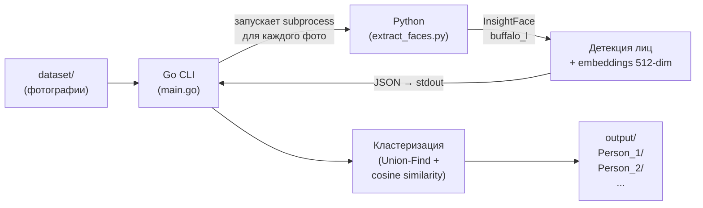

# Face Grouping Service

Сервис для автоматической группировки фотографий по людям. Анализирует изображения при помощи нейросетевой модели [InsightFace](https://github.com/deepinsight/insightface), извлекает face embeddings и кластеризует лица по косинусному сходству.

## Как это работает



### Пайплайн

1. **Сканирование** — Go обходит входную директорию и собирает все `.jpeg`, `.jpg`, `.png` файлы
2. **Извлечение embeddings** — для каждого фото запускается Python-скрипт с InsightFace (модель `buffalo_l`). Скрипт детектирует лица и возвращает 512-мерные нормализованные embedding-векторы в формате JSON
3. **Кластеризация** — Go вычисляет косинусное сходство между всеми парами embeddings и группирует лица через алгоритм Union-Find (disjoint set с path compression и union by rank)
4. **Организация** — для каждого кластера создается папка `Person_N/` с символическими ссылками на оригинальные файлы. Папки сортируются по количеству фото (Person_1 — самый частый человек)

> Если на фото несколько людей — оно появится в нескольких папках `Person_N/`.

## Требования

| Компонент | Версия |
|-----------|--------|
| Go | 1.23+ |
| Python | 3.10+ |
| ОС | Windows / Linux / macOS |

На **Windows** для создания символических ссылок необходим Developer Mode или запуск от имени администратора.

## Установка

```bash
# 1. Сборка Go-бинарника
go build -o face-grouper.exe .

# 2. Установка Python-зависимостей
pip install -r scripts/requirements.txt
```

При первом запуске InsightFace автоматически скачает модель `buffalo_l` (~300 MB) в `~/.insightface/models/`.

## Запуск

```bash
# Базовый запуск (фото из ./dataset, результат в ./output)
./face-grouper.exe

# С указанием параметров
./face-grouper.exe --input ./my-photos --output ./results --workers 8 --threshold 0.6
```

### Параметры CLI

| Флаг | По умолчанию | Описание |
|------|-------------|----------|
| `--input` | `./dataset` | Директория с исходными фотографиями |
| `--output` | `./output` | Директория для результатов группировки |
| `--workers` | `4` | Количество параллельных воркеров для извлечения embeddings |
| `--threshold` | `0.5` | Порог косинусного сходства для объединения лиц (0.0–1.0). Выше — строже, ниже — больше ложных совпадений |
| `--python` | `python` | Путь к Python-интерпретатору |

### Пример вывода

```
=== Scanning directory ===
Found 685 image(s)

=== Extracting face embeddings ===
[1/685] C:\photos\TCF_001.jpeg — found 2 face(s)
[2/685] C:\photos\TCF_002.jpeg — found 1 face(s)
...

Total faces detected: 1247

=== Clustering faces ===
Found 42 person(s)

=== Organizing output ===
Person_1: 87 unique photo(s)
Person_2: 64 unique photo(s)
...

Done in 12m34s. Results in: ./output
```

## Структура проекта

```
├── main.go                            # Точка входа, CLI-флаги, оркестрация пайплайна
├── go.mod
├── internal/
│   ├── models/
│   │   └── models.go                  # Типы данных: Face, ExtractionResult, Cluster
│   ├── scanner/
│   │   └── scanner.go                 # Рекурсивное сканирование директории
│   ├── extractor/
│   │   └── extractor.go               # Worker pool, вызов Python subprocess, парсинг JSON
│   ├── clustering/
│   │   └── clustering.go              # Union-Find + cosine similarity кластеризация
│   └── organizer/
│       └── organizer.go               # Создание Person_N/ директорий с symlinks
├── scripts/
│   ├── extract_faces.py               # Python: InsightFace детекция + извлечение embeddings
│   └── requirements.txt               # Python-зависимости
├── dataset/                           # Исходные фотографии для обработки
└── output/                            # Результат: Person_N/ с символическими ссылками
```

## Модули

### `internal/models` — типы данных

- **`Face`** — обнаруженное лицо: bounding box `[x1, y1, x2, y2]`, 512-мерный embedding, уверенность детекции, путь к исходному файлу
- **`ExtractionResult`** — JSON-ответ от Python-скрипта: список лиц + опциональная ошибка
- **`Cluster`** — группа лиц одного человека

### `internal/scanner` — сканирование

Рекурсивно обходит директорию через `filepath.Walk`, фильтрует по расширениям (`.jpeg`, `.jpg`, `.png`), возвращает абсолютные пути.

### `internal/extractor` — извлечение embeddings

Запускает `python extract_faces.py <path>` через `os/exec` для каждого файла. Использует worker pool с настраиваемым числом горутин для параллельной обработки. Читает JSON из stdout процесса.

### `internal/clustering` — кластеризация

Для каждой пары лиц вычисляет косинусное сходство embeddings. Если сходство >= порога — объединяет через Union-Find (disjoint set с path compression и union by rank). Сложность: O(n^2) по числу лиц.

### `internal/organizer` — организация результатов

Создает директории `output/Person_N/`, сортирует кластеры по размеру (Person_1 — самая большая группа). Создает символические ссылки на оригиналы. Дедуплицирует — если одно лицо детектировано несколько раз на одном фото, ссылка создается единожды.

### `scripts/extract_faces.py` — Python-скрипт

Использует `insightface.app.FaceAnalysis` с моделью `buffalo_l` (SCRFD детектор + ArcFace эмбеддер). Возвращает JSON:

```json
{
  "faces": [
    {
      "bbox": [102.5, 45.2, 287.1, 310.8],
      "embedding": [0.0123, -0.0456, ...],
      "det_score": 0.95
    }
  ]
}
```

## Настройка порога

Параметр `--threshold` контролирует строгость группировки:

| Значение | Эффект |
|----------|--------|
| `0.3` | Агрессивная группировка, больше ложных совпадений |
| `0.5` | Сбалансированный (по умолчанию) |
| `0.7` | Строгая группировка, может разбить одного человека на несколько кластеров |

Рекомендуется начать с `0.5` и корректировать по результатам.

## Зависимости

### Go

Стандартная библиотека, внешних зависимостей нет.

### Python

| Пакет | Назначение |
|-------|-----------|
| `insightface` | Детекция лиц и извлечение face embeddings (модель buffalo_l) |
| `onnxruntime` | Инференс ONNX-моделей на CPU |
| `numpy` | Работа с массивами embeddings |
| `opencv-python-headless` | Чтение изображений |

## Лицензия

MIT
