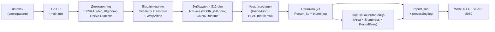

# Face Grouping Service

[](https://github.com/kont1n/face-grouper/actions/workflows/go.yml)
[](https://github.com/kont1n/face-grouper/pkgs/container/face-grouper)
[](https://github.com/kont1n/face-grouper/pkgs/container/face-grouper)
[](LICENSE)

[](https://goreportcard.com/report/github.com/kont1n/face-grouper)
[](https://pkg.go.dev/github.com/kont1n/face-grouper)

Сервис для автоматической группировки фотографий по людям. Анализирует изображения при помощи нейросетевых моделей [InsightFace](https://github.com/deepinsight/insightface) (SCRFD + ArcFace) через ONNX Runtime, извлекает face embeddings и кластеризует лица по косинусному сходству. Полностью нативная Go-реализация без зависимости от Python и OpenCV. Поддерживает GPU-ускорение (CUDA, ROCm), BLAS-ускоренную кластеризацию, асинхронную обработку через REST API с SSE-стримингом прогресса, опциональную PostgreSQL интеграцию и веб-интерфейс.

## Особенности

| Feature | CPU | NVIDIA GPU | AMD GPU |
|---------|-----|------------|---------|
| **Support** | ✅ | ✅ | ✅ |
| **Docker** | ✅ | ✅ | ✅ |
| **Performance** | Baseline | 5-10x faster | 3-8x faster |
| **Provider** | Default | CUDA | ROCm |

**Quick Links:**
- [Docker Deployment](docs/DOCKER.md)
- [Quick Start](docs/QUICKSTART.md)
- [Download Models](docs/DOWNLOAD_MODELS.md)
- [Database Guide](docs/DATABASE.md)
- [Documentation Index](docs/README.md)
- [GPU Setup](docs/DOCKER.md#gpu-support)

## Архитектура

Проект использует **Clean Architecture** с разделением на слои:

```
cmd/
└── main.go                    # Точка входа (DI, graceful shutdown)

internal/
├── api/
│   ├── cli/                   # CLI API (Scan, Extract, Cluster, Organize)
│   └── http/
│       ├── handler/           # HTTP обработчики (session, person, upload, health)
│       └── middleware/        # Recovery, RateLimit, CORS, RequestLogger
├── app/                       # Приложение + DI контейнер
│   ├── app.go                 # Основная оркестрация
│   ├── di.go                  # Dependency Injection
│   └── pipeline.go            # Асинхронный pipeline runner (SSE)
├── config/                    # Конфигурация (.env + ENV)
│   ├── config.go
│   └── env/
├── database/                  # PostgreSQL интеграция (опционально)
│   ├── database.go            # DB connection & repositories
│   ├── migrations.go          # Auto-migrations
│   └── postgres/              # Connection pool & health
├── infrastructure/
│   └── ml/                    # ONNX Runtime inference
│       ├── provider/          # CPU/CUDA/ROCm провайдеры
│       ├── detector.go        # SCRFD детектор
│       ├── recognizer.go      # ArcFace распознавание
│       └── align.go           # Umeyama выравнивание
├── model/                     # Доменные модели (Face, Cluster)
├── repository/                # Слой доступа к данным
│   ├── filesystem/            # Сканирование файловой системы
│   └── postgres/              # PostgreSQL repositories
├── service/                   # Бизнес-логика
│   ├── scan/                  # Сканирование директорий
│   ├── extraction/            # Извлечение embeddings (worker pool, batcher)
│   ├── clustering/            # Кластеризация лиц
│   └── organization/          # Организация результатов (Person_N/, аватары)
├── clustering/                # Union-Find + BLAS матрица сходства
├── organizer/                 # Организация вывода
├── avatar/                    # Выбор аватара по quality score
├── imageutil/                 # Чистый Go: resize, crop, WarpAffine, NCHW
├── report/                    # JSON-отчёт о обработке
├── domain/                    # Доменные ошибки
└── web/                       # HTTP сервер
    ├── server.go              # Маршруты, middleware, graceful shutdown
    └── index.html             # SPA (встроен через embed)

platform/pkg/                  # Платформенные пакеты
├── closer/                    # Graceful shutdown с таймаутом
└── logger/                    # Zap logger wrapper
```

### Слои

| Слой | Ответственность |
|------|----------------|
| **API/HTTP** | REST обработчики, маппинг запросов, SSE стриминг |
| **API/CLI** | CLI координация: Scan → Extract → Cluster → Organize |
| **Service** | Бизнес-логика, координация между репозиториями |
| **Infrastructure/ML** | ONNX Runtime inference (детекция, распознавание, выравнивание) |
| **Repository** | Доступ к данным (файлы, PostgreSQL) |
| **Model** | Доменные модели (Face, Cluster, Person) |
| **Config** | Конфигурация приложения (.env + ENV) |
| **Platform** | Инфраструктурные компоненты (logger, closer) |

## Как это работает



### Пайплайн

1. **Сканирование** — Go обходит входную директорию и собирает все `.jpeg`, `.jpg`, `.png` файлы
2. **Детекция лиц** — SCRFD модель (`det_10g.onnx`) через ONNX Runtime Go биндинги: letterbox preprocessing (640x640), 3-уровневый FPN (strides 8/16/32), декодирование bbox + keypoints, NMS (IoU 0.4)
3. **Выравнивание лиц** — similarity transform (Umeyama algorithm) по 5 ключевым точкам, WarpAffine до 112x112 на чистом Go (билинейная интерполяция)
4. **Извлечение embeddings** — ArcFace модель (`w600k_r50.onnx`): нормализация (mean=127.5, std=127.5), batch inference, L2-нормализация 512-мерных векторов
5. **Генерация миниатюр** — для каждого обнаруженного лица вырезается crop с паддингом 25%, масштабируется до 160x160 и сохраняется как JPEG (quality 90)
6. **Кластеризация** — Go вычисляет матрицу косинусного сходства через BLAS-ускоренное блочное матричное перемножение (gonum) и группирует лица через Union-Find (disjoint set с path compression и union by rank)
7. **Организация** — для каждого кластера создается папка `Person_N/` с символическими ссылками на оригиналы и лучшей миниатюрой лица (`thumb.jpg`); при совпадающих именах файлов применяется уникализация
8. **Выбор аватара** — для каждой персоны выбирается лучший crop по формуле `Score = Area × Sharpness × FrontalPoseFactor`; обновление выполняется только при приросте качества выше порога
9. **Отчёт** — сохраняется JSON-отчёт (`report.json`) и лог обработки (`processing.log`)
10. **Веб-интерфейс (опционально)** — Go HTTP-сервер с REST API, SSE-стримингом прогресса и graceful shutdown

> Если на фото несколько людей — оно появится в нескольких папках `Person_N/`.

> На **Windows** для создания символических ссылок необходим Developer Mode или запуск от имени администратора.

## REST API

Веб-сервер предоставляет полноценный REST API.

### Системные эндпоинты

| Метод | Путь | Описание |
|-------|------|----------|
| `GET` | `/health` | Health check (статус сервера + БД) |
| `GET` | `/ready` | Readiness probe (Kubernetes) |
| `GET` | `/api/report` | JSON-отчёт последней обработки |
| `GET` | `/output/*` | Статические файлы результатов |

### Обработка (Sessions)

| Метод | Путь | Описание |
|-------|------|----------|
| `POST` | `/api/v1/sessions/{id}/process` | Запуск асинхронного пайплайна |
| `GET` | `/api/v1/sessions/{id}/status` | Статус сессии |
| `GET` | `/api/v1/sessions/{id}/stream` | SSE: стриминг прогресса в реальном времени |
| `GET` | `/api/v1/sessions/{id}/errors` | Ошибки сессии |

**Запуск обработки:**
```json
POST /api/v1/sessions/my-session-1/process
{ "input_dir": "./dataset" }

Response 202:
{ "session_id": "my-session-1", "status": "processing" }
```

**SSE Events** (`GET /api/v1/sessions/{id}/stream`):
```
data: {"session_id":"my-session-1","stage":"extract","stage_label":"Обнаружение лиц...","progress":0.5,"done":false,"elapsed_ms":12340}
data: {"session_id":"my-session-1","stage":"cluster","progress":1.0,"done":true,"elapsed_ms":45000}
```

### Персоны

| Метод | Путь | Описание |
|-------|------|----------|
| `GET` | `/api/v1/persons` | Список персон (с пагинацией: `?offset=0&limit=50`) |
| `GET` | `/api/v1/persons/{id}` | Детали персоны |
| `PUT` | `/api/v1/persons/{id}` | Переименование (требует БД) |
| `GET` | `/api/v1/persons/{id}/photos` | Фотографии персоны (с пагинацией) |
| `GET` | `/api/v1/persons/{id}/relations` | Граф связей (требует БД; `?min_similarity=0.5`) |

### Загрузка

| Метод | Путь | Описание |
|-------|------|----------|
| `POST` | `/api/v1/upload` | Загрузка изображений (макс. 500MB) |

> **Примечание:** Эндпоинты, помеченные "требует БД", возвращают `503 Service Unavailable` без PostgreSQL. Эндпоинты `GET /persons` и `GET /persons/{id}/photos` автоматически деградируют до `report.json` при отсутствии БД.

## Требования

| Компонент | Версия | Примечание |
|-----------|--------|------------|
| Go | 1.24+ | Основной язык |
| ONNX Runtime | 1.20+ | CPU или GPU версия |
| ОС | Windows / Linux / macOS | |
| GPU (опционально) | NVIDIA + CUDA 11.8+ | Для GPU-ускорения |
| cuDNN (опционально) | 8.x | Для GPU-ускорения |
| PostgreSQL (опционально) | 16+ с pgvector | Для персистентного хранения |

> **Примечание:** Проект использует чистый Go для обработки изображений и не требует OpenCV/gocv.

> **Примечание:** PostgreSQL опционален — приложение запускается и без него, читая данные из `report.json`.

## Установка

### 1. Конфигурация

Создайте файл `.env` в корне проекта (или используйте `.env.example` как шаблон):

```bash
# === Application ===
INPUT_DIR=./dataset
OUTPUT_DIR=./output

# === Models ===
MODELS_DIR=./models

# === Extraction ===
EXTRACT_WORKERS=4
GPU_ENABLED=0              # 1 для GPU, 0 для CPU
GPU_DET_SESSIONS=2
GPU_REC_SESSIONS=2
EMBED_BATCH_SIZE=64
EMBED_FLUSH_MS=10
MAX_DIM=1920
DET_THRESH=0.5

# === Clustering ===
CLUSTER_THRESHOLD=0.5

# === Organizer ===
AVATAR_UPDATE_THRESHOLD=0.10

# === Web ===
WEB_PORT=8080
WEB_SERVE=false
WEB_VIEW_ONLY=false

# === Logger ===
LOG_LEVEL=info
LOG_JSON=false

# === Database (опционально) ===
# DB_HOST=localhost
# DB_PORT=5432
# DB_NAME=face-grouper
# DB_USER=face-grouper
# DB_PASSWORD=secret
# DB_SSLMODE=disable
# DB_RUN_MIGRATIONS=true
```

### 2. ONNX Runtime

Скачайте shared library с [github.com/microsoft/onnxruntime/releases](https://github.com/microsoft/onnxruntime/releases):

- **Windows CPU**: `onnxruntime.dll` (из `onnxruntime-win-x64-*.zip`)
- **Windows GPU**: `onnxruntime.dll` (из `onnxruntime-win-x64-gpu-*.zip`)
- **Linux**: `libonnxruntime.so` (из `onnxruntime-linux-x64-*.tgz`)
- **macOS**: `libonnxruntime.dylib` (из `onnxruntime-osx-*.tgz`)

Поместите библиотеку в корень проекта или любую директорию в `PATH`/`LD_LIBRARY_PATH`.

### 3. ONNX-модели InsightFace

Скачайте модели из пакета `buffalo_l`:

- `det_10g.onnx` (~17 MB) — SCRFD детектор лиц
- `w600k_r50.onnx` (~174 MB) — ArcFace распознавание лиц

**Через Python (рекомендуется):**
```bash
pip install huggingface_hub
python -c "from huggingface_hub import hf_hub_download; hf_hub_download('deepinsight/insightface', 'buffalo_l/det_10g.onnx', local_dir='./models')"
python -c "from huggingface_hub import hf_hub_download; hf_hub_download('deepinsight/insightface', 'buffalo_l/w600k_r50.onnx', local_dir='./models')"
```

**Через скрипт:**
```bash
python scripts/download_models.py
```

Подробнее: [docs/DOWNLOAD_MODELS.md](docs/DOWNLOAD_MODELS.md)

### 4. Сборка проекта

```bash
# Linux / macOS
go build -o face-grouper ./cmd

# Windows
go build -o face-grouper.exe ./cmd
```

## Запуск

### Режимы работы

```bash
# Обработка с последующим просмотром в браузере
./face-grouper --serve

# Только обработка (без веб-интерфейса)
./face-grouper

# Просмотр предыдущих результатов (без повторной обработки)
./face-grouper --view

# GPU режим
./face-grouper --serve  # GPU_ENABLED=1 в .env или --gpu флаг
```

### CLI флаги

| Флаг | .env переменная | По умолчанию | Описание |
|------|----------------|-------------|----------|
| `--input` | `INPUT_DIR` | `./dataset` | Директория с фотографиями |
| `--output` | `OUTPUT_DIR` | `./output` | Директория для результатов |
| `--models-dir` | `MODELS_DIR` | `./models` | Директория с ONNX-моделями |
| `--workers` | `EXTRACT_WORKERS` | `4` | Количество воркеров (CPU) |
| `--gpu` | `GPU_ENABLED` | `false` | Использовать GPU |
| `--gpu-det-sessions` | `GPU_DET_SESSIONS` | `2` | Detector сессий (GPU) |
| `--gpu-rec-sessions` | `GPU_REC_SESSIONS` | `2` | Recognizer сессий (GPU) |
| `--embed-batch-size` | `EMBED_BATCH_SIZE` | `64` | Размер батча распознавания |
| `--embed-flush-ms` | `EMBED_FLUSH_MS` | `10` | Таймаут flush батча (мс) |
| `--threshold` | `CLUSTER_THRESHOLD` | `0.5` | Порог кластеризации (0.0–1.0) |
| `--det-thresh` | `DET_THRESH` | `0.5` | Порог детекции лиц |
| `--max-dim` | `MAX_DIM` | `1920` | Макс. размер изображения (0 = без ресайза) |
| `--avatar-update-threshold` | `AVATAR_UPDATE_THRESHOLD` | `0.10` | Порог обновления аватара |
| `--serve` | `WEB_SERVE` | `false` | Запустить веб-интерфейс |
| `--port` | `WEB_PORT` | `8080` | Порт веб-сервера |
| `--view` | `WEB_VIEW_ONLY` | `false` | Только просмотр |

> **Примечание:** CLI флаги имеют приоритет над `.env` файлом.

### Пример вывода

```
=== Scanning directory ===
Found 685 image(s)

=== Extracting face embeddings ===
Mode: CPU, 4 worker(s)
Pre-resize: max 1920px
[1/685] photos/TCF_001.jpeg — found 2 face(s)
[2/685] photos/TCF_002.jpeg — found 1 face(s)
...

Total faces detected: 1247 (errors: 3)

=== Clustering faces ===
Found 42 person(s)

=== Organizing output ===
Person_1: 87 unique photo(s)
Person_2: 64 unique photo(s)
...

=== Summary ===
Images:  685
Faces:   1247
Persons: 42
Errors:  3
Time:    4m12s

=== Stage timings ===
Scan:           120ms
Extract:        3m45s
Cluster:        8s
OrganizeAvatar: 19s
Report:  ./output/report.json
Log:     ./output/processing.log

Tip: run with --serve to view results in browser, or --view to view previous results
```

## Алгоритмический выбор аватара

Для каждой персоны вычисляется quality score по формуле:

`Score = (Width × Height) × Sharpness × FrontalPoseFactor`

- `Width × Height` — площадь лица по bbox
- `Sharpness` — дисперсия лапласиана по crop лица (мера резкости)
- `FrontalPoseFactor` — фактор фронтальности (по landmark-геометрии, ближе к 1 при меньшем повороте)

Если при повторной обработке новый score не превосходит предыдущий на `--avatar-update-threshold` (по умолчанию 10%), аватар не обновляется.

## Веб-интерфейс

Встроенный HTTP-сервер с graceful shutdown (таймаут 10 сек) и тёмной темой:

- Сетка карточек персон с миниатюрами лиц и количеством фото
- Отображение выбранного алгоритмом аватара и `quality_score`
- Просмотр всех фотографий персоны по клику
- Кликабельный счётчик ошибок с детализацией
- Полноэкранный просмотр фото
- Адаптивная вёрстка

Запуск: `--serve` (после обработки) или `--view` (просмотр готовых результатов).

### Middleware

| Middleware | Параметры |
|-----------|-----------|
| Recovery | Перехват паник |
| RateLimit | 100 rps sustained, 200 burst |
| MaxBodySize | 500MB |
| CORS | Все источники |
| RequestLogger | Структурированный лог |

## PostgreSQL (опционально)

База данных опциональна — приложение работает и без неё, читая данные из `report.json`.

**Быстрый старт:**
```bash
docker run -d --name face-grouper-db \
  -e POSTGRES_DB=face-grouper \
  -e POSTGRES_USER=face-grouper \
  -e POSTGRES_PASSWORD=secret \
  -p 5432:5432 \
  pgvector/pgvector:pg16
```

**Возможности при наличии БД:**
- Персистентное хранение результатов (persons, faces, photos)
- Векторный поиск похожих лиц через pgvector (cosine similarity)
- Full-text search по именам (русский язык)
- Граф связей между персонами
- Переименование персон через API (`PUT /api/v1/persons/{id}`)
- Трекинг сессий обработки
- Auto-migrations при старте

Подробнее: [docs/DATABASE.md](docs/DATABASE.md)

## Настройка порога

Параметр `--threshold` контролирует строгость группировки:

| Значение | Эффект | Когда использовать |
|----------|--------|-------------------|
| `0.30-0.35` | Очень строгая группировка, минимум ложных совпадений | Когда на фото много разных людей |
| `0.40-0.45` | Строгая группировка, баланс точности | Для смешанных наборов фото |
| `0.50` | Сбалансированный (по умолчанию) | Универсальный вариант |
| `0.60-0.70` | Агрессивная группировка, больше ложных совпадений | Когда на фото преимущественно один человек |

> **Для ArcFace/InsightFace:** типичное косинусное сходство — один человек: 0.50-0.90, разные люди: 0.00-0.40.

Рекомендуется начать с `0.50` и корректировать по результатам.

## Тестирование и CI

### Разработка с Taskfile

```bash
task build           # Сборка приложения
task test            # Запуск тестов
task lint            # golangci-lint
task format          # gofumpt + gci
task install-tools   # Установка инструментов разработки
task docker:run      # Запуск Docker контейнера
task benchmark       # Бенчмарки CPU vs GPU
task clean           # Очистка
```

### Локальные тесты

```bash
go test ./...
go test -v -coverprofile=coverage.out ./...
go test ./internal/clustering -bench BenchmarkCluster -benchmem
```

### CI (GitHub Actions)

- `.github/workflows/ci.yml` — unit-тесты, lint
- `.github/workflows/docker-build.yml` — сборка Docker образов (CPU, GPU, ROCm), security сканирование Trivy, публикация в GHCR

## Зависимости

| Пакет | Назначение |
|-------|-----------|
| `github.com/yalue/onnxruntime_go` | Go-биндинги для ONNX Runtime (CPU/CUDA/ROCm inference) |
| `golang.org/x/image` | Обработка изображений на чистом Go |
| `gonum.org/v1/gonum` | BLAS-ускоренное матричное перемножение для кластеризации |
| `github.com/jackc/pgx/v5` | PostgreSQL драйвер (pgx) |
| `github.com/pgvector/pgvector-go` | pgvector Go клиент |
| `github.com/google/uuid` | UUID генерация |
| `github.com/joho/godotenv` | .env парсинг |
| `go.uber.org/zap` | Структурированное логирование |

## Лицензия

MIT
